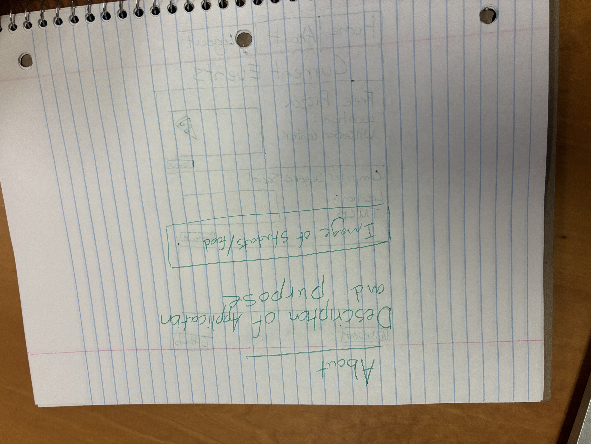
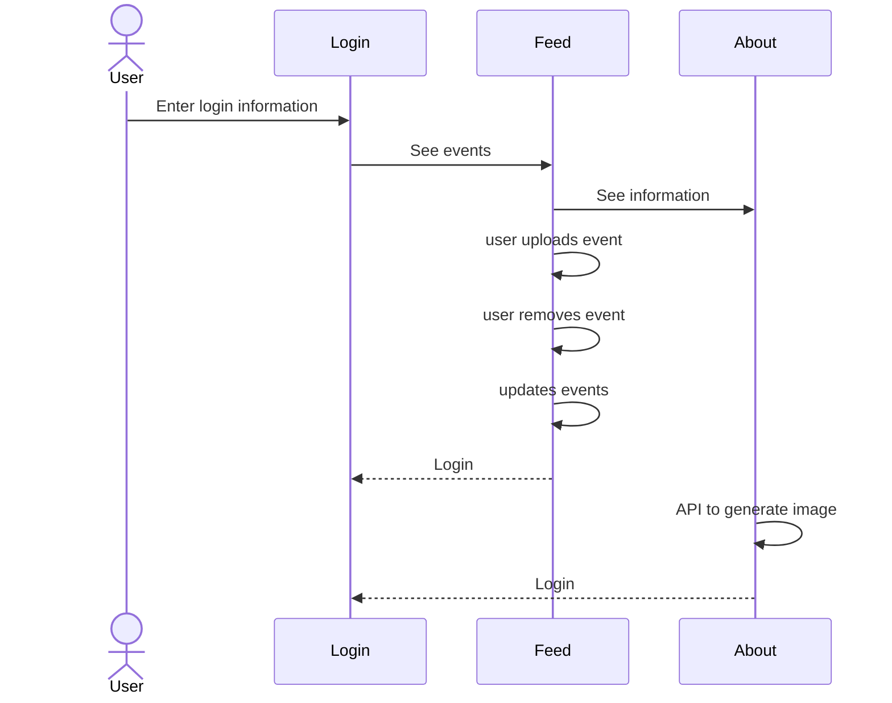

# Student Sustenance (Campus Food and Event App)

[My Notes](notes.md)

As a college student it is always great to be able to find free food and events around campus. It not only helps keep us physically fed, but also socially fed as we go with our friends and meet new people. For my startup I would like to make an application where students can share the location of free food and events they find around campus. Once completed, students will be able to upload a picture and location of any event around campus. Then other students will be able to see the location of the event on a campus wide feed and be able to remove it once it is over. This will help students stay fed and help build community and knowledge of events all around campus. 

The sections below will describe what my application is, what it is supposed to do, and the technologies that it will use.

### Elevator pitch

When going to school the last thing students want to worry about is the cost of food. Now imagine if there was an app that was always updated with free food and event information all around campus. The Student Sustenance app will be able to help students conveniently track the location of free meals and events around campus in real time. Helping students to not only stay physically full but also socially as they attend events with their friends and meet new people! 

### Design

.jpeg)

The sequence diagram below shows the applications backend as the users interact with it.

### Key features

- Secure log in, log out, and registration
- View campus events in real time
- Upload the location and a picture of current campus events
- Remove when it has ended

### Technologies

I am going to use the required technologies in the following ways.

- **HTML** - Correct HTML structure. Three different views. A log in view, feed view, and about view.
- **CSS** - Good styling. Application will fit on a variety of different sizes of screens.
- **React** - App registration. Upload, post, and delete events. Switch views.
- **Service** - A database that stores user and event information. Call to a third party API to generate random image of food on about page through https://foodish-api.com/api/
- **DB/Login** - Stores login information and events.
- **WebSocket** - Live relay of event information from one device to another.
  
## 🚀 Specification Deliverable

> [!NOTE]
> Fill in this sections as the submission artifact for this deliverable. You can refer to this [example](https://github.com/webprogramming260/startup-example/blob/main/README.md) for inspiration.

For this deliverable I did the following. I checked the box `[x]` and added a description for things I completed.

- [x] I completed the prerequisites for this deliverable (Git commit requirement). - I have done 35 commits over the last 3 days.
- [x] Proper use of Markdown. - I studied markdown formatting and did my best to use it properly.
- [x] A concise and compelling elevator pitch. - I created an elevator pitch stating what my application is and some of its purposes. 
- [x] Description of key features. - I described key features of the application I want to make.
- [x] Description of how you will use each technology including your 3rd party API and use of WebSocket. - I described my use of all the technologies including websocket to update the feed of my application and a 3rd party API to generate images.
- [x] One or more rough sketches of your application. Images must be embedded in this file using Markdown image references. - I included 3 images that I drew by hand as rough sketches of my application.

## 🚀 AWS deliverable

For this deliverable I did the following. I checked the box `[x]` and added a description for things I completed.

- [ ] **Rented EC2 server** - I did not complete this part of the deliverable.
- [ ] **Leased domain name** - I did not complete this part of the deliverable.
- [ ] **Server accessible** from my domain: [https://yourdomainnamehere.click](https://yourdomainnamehere.click) - I did not complete this part of the deliverable.

## 🚀 HTML deliverable

For this deliverable I did the following. I checked the box `[x]` and added a description for things I completed.

- [ ] I completed the prerequisites for this deliverable (Simon deployed, GitHub link, Git commits)
- [ ] **HTML pages** - I did not complete this part of the deliverable.
- [ ] **Proper HTML element usage** - I did not complete this part of the deliverable.
- [ ] **Links** - I did not complete this part of the deliverable.
- [ ] **Text** - I did not complete this part of the deliverable.
- [ ] **3rd party API placeholder** - I did not complete this part of the deliverable.
- [ ] **Images** - I did not complete this part of the deliverable.
- [ ] **Login placeholder** - I did not complete this part of the deliverable.
- [ ] **DB data placeholder** - I did not complete this part of the deliverable.
- [ ] **WebSocket placeholder** - I did not complete this part of the deliverable.

## 🚀 CSS deliverable

For this deliverable I did the following. I checked the box `[x]` and added a description for things I completed.

- [ ] I completed the prerequisites for this deliverable (Simon deployed, GitHub link, Git commits)
- [ ] **Visually appealing colors and layout. No overflowing elements.** - I did not complete this part of the deliverable.
- [ ] **Use of a CSS framework** - I did not complete this part of the deliverable.
- [ ] **All visual elements styled using CSS** - I did not complete this part of the deliverable.
- [ ] **Responsive to window resizing using flexbox and/or grid display** - I did not complete this part of the deliverable.
- [ ] **Use of a imported font** - I did not complete this part of the deliverable.
- [ ] **Use of different types of selectors including element, class, ID, and pseudo selectors** - I did not complete this part of the deliverable.

## 🚀 React part 1: Routing deliverable

For this deliverable I did the following. I checked the box `[x]` and added a description for things I completed.

- [ ] I completed the prerequisites for this deliverable (Simon deployed, GitHub link, Git commits)
- [ ] **Bundled using Vite** - I did not complete this part of the deliverable.
- [ ] **Components** - I did not complete this part of the deliverable.
- [ ] **Router** - I did not complete this part of the deliverable.

## 🚀 React part 2: Reactivity deliverable

For this deliverable I did the following. I checked the box `[x]` and added a description for things I completed.

- [ ] I completed the prerequisites for this deliverable (Simon deployed, GitHub link, Git commits)
- [ ] **All functionality implemented or mocked out** - I did not complete this part of the deliverable.
- [ ] **Hooks** - I did not complete this part of the deliverable.

## 🚀 Service deliverable

For this deliverable I did the following. I checked the box `[x]` and added a description for things I completed.

- [ ] I completed the prerequisites for this deliverable (Simon deployed, GitHub link, Git commits)
- [ ] **Node.js/Express HTTP service** - I did not complete this part of the deliverable.
- [ ] **Static middleware for frontend** - I did not complete this part of the deliverable.
- [ ] **Calls to third party endpoints** - I did not complete this part of the deliverable.
- [ ] **Backend service endpoints** - I did not complete this part of the deliverable.
- [ ] **Frontend calls service endpoints** - I did not complete this part of the deliverable.
- [ ] **Supports registration, login, logout, and restricted endpoint** - I did not complete this part of the deliverable.
- [ ] **Uses BCrypt to hash passwords** - I did not complete this part of the deliverable.

## 🚀 DB deliverable

For this deliverable I did the following. I checked the box `[x]` and added a description for things I completed.

- [ ] I completed the prerequisites for this deliverable (Simon deployed, GitHub link, Git commits)
- [ ] **Stores data in MongoDB** - I did not complete this part of the deliverable.
- [ ] **Stores credentials in MongoDB** - I did not complete this part of the deliverable.

## 🚀 WebSocket deliverable

For this deliverable I did the following. I checked the box `[x]` and added a description for things I completed.

- [ ] I completed the prerequisites for this deliverable (Simon deployed, GitHub link, Git commits)
- [ ] **Backend listens for WebSocket connection** - I did not complete this part of the deliverable.
- [ ] **Frontend makes WebSocket connection** - I did not complete this part of the deliverable.
- [ ] **Data sent over WebSocket connection** - I did not complete this part of the deliverable.
- [ ] **WebSocket data displayed** - I did not complete this part of the deliverable.
- [ ] **Application is fully functional** - I did not complete this part of the deliverable.

Change from my development environment!

Change from github/vs code web console!
